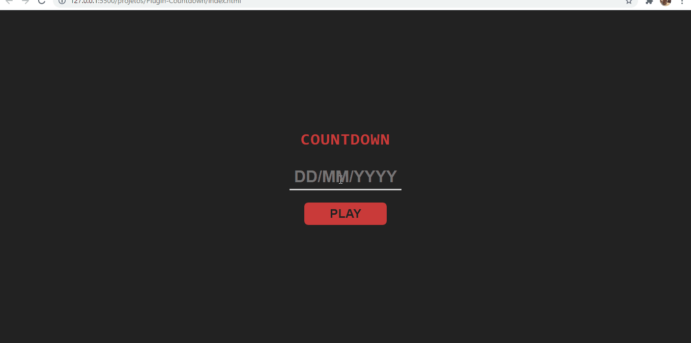
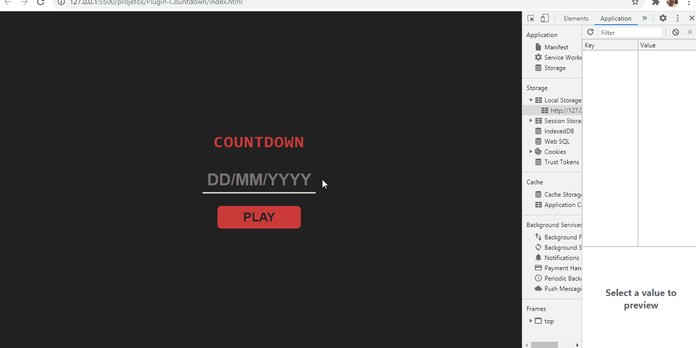

# Plugin Countdown
</img>

# Informaçoes:
- Conatagem regressiva ate a data inserida pelo usuario.
- Salva os valores da data no LocalStorage.
- Api que recebe os valores criada 100% com Class, em um modulo separado.

## Localstorage:
</img>

# Tecnologias:
 -  Html5
 -  Css3
 -  JavaScript

## Style:
<pre>
    display: flex;
    colors: #ca3b3a, #ccc , #222 e #555 .
    font-Family: monospace;
</pre>

## OBSERVAÇAO:
<pre>
    Em caso de teste do codigo, use um servidor local para o funcionamento da aplicaçao.
    Live-server é um exemplo.
</pre>
